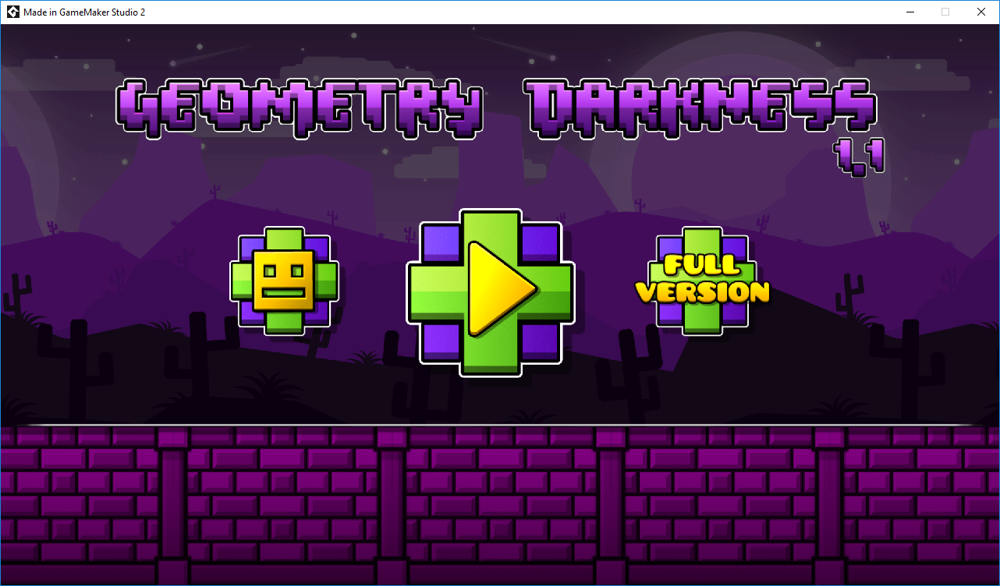
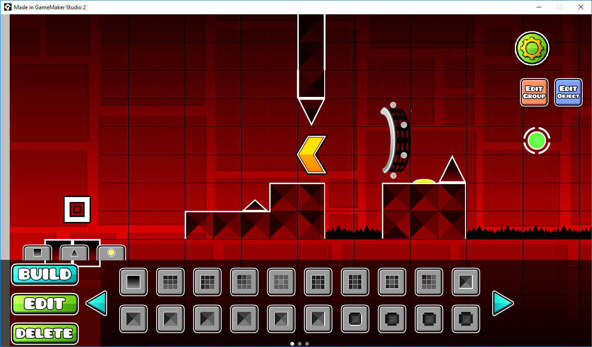
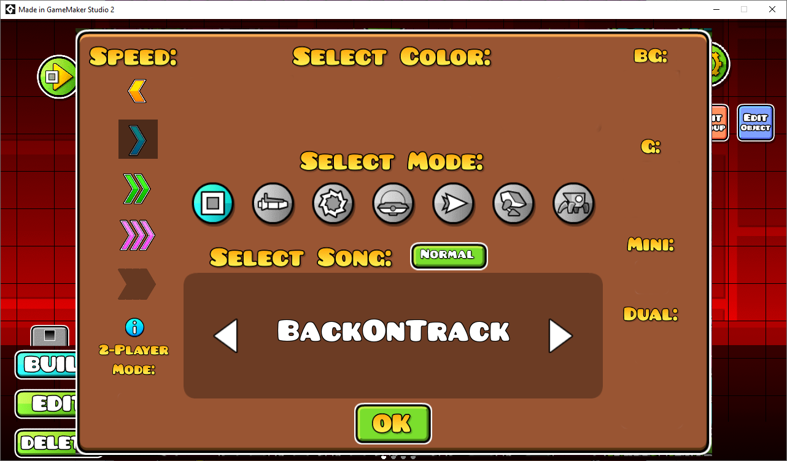

# Geometry Dash
Geometry dash (aka GDCommunity) is aimed to be an opensource clone of Geometry Dash with all its features, including servers, fully featured editor, Gauntlets, and many other features that never may be added, such as a realtime multiplayer.

Here's the actual game in action (This could change soon, so you better clone the repo and build it by yourself in GameMaker:Studio 2)

# Features
- Powerful in-game editor
- A very similar playability to the original Geometry Dash
- All the vehicles
- All the speeds
- A very good-lookin' editor
- A lot of objects in game (in the editor too)
- Rings
- Paths
- Fully customizable project, you can clone it, and modify it as you want, isn't neccessary to gimmie credits, you can even sell it if you want without any problem ('least with me, with RobTop maybe xd)