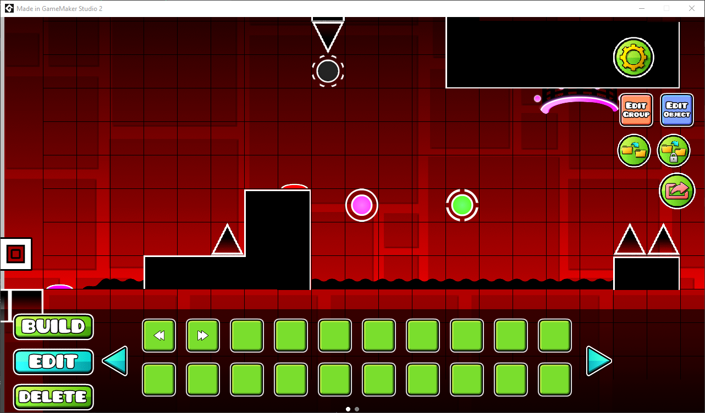
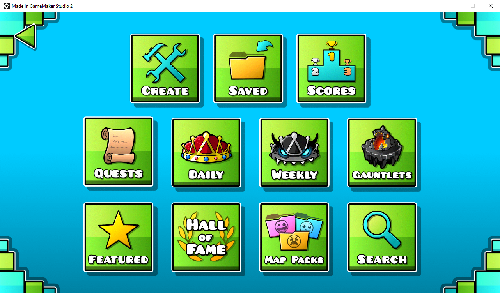
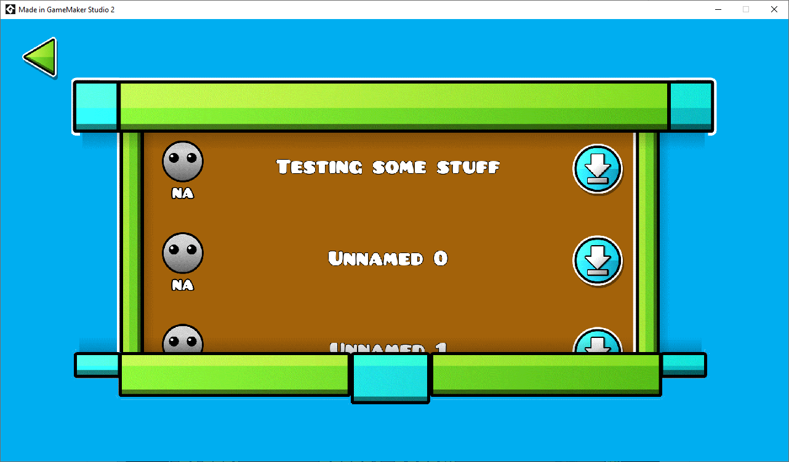
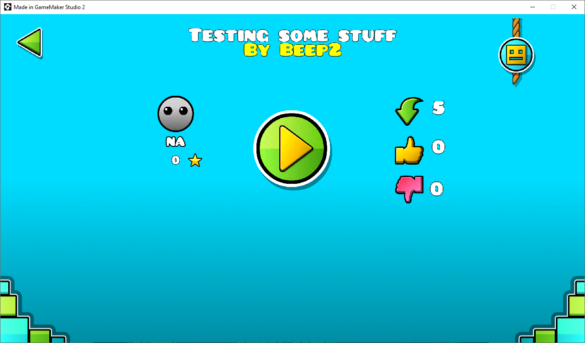
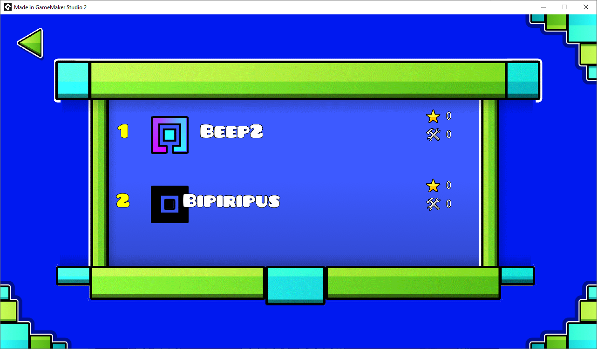
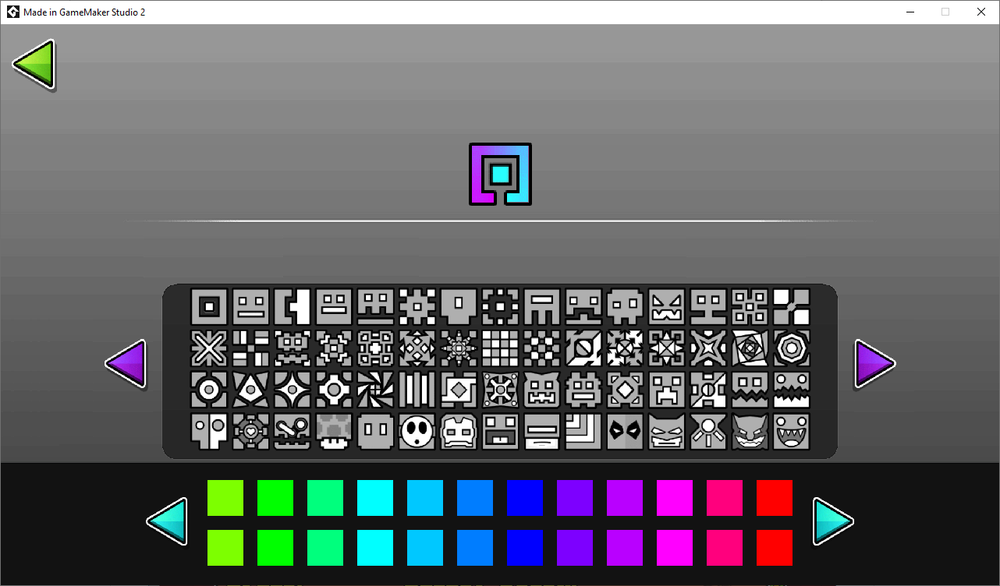

# Geometry Dash
Geometry dash (aka GDCommunity) is aimed to be an opensource clone of Geometry Dash with all its features, including servers, fully featured editor, Gauntlets, and many other features that never may be added, such as a realtime multiplayer.

Here's the actual game in action (This could change soon, so you better clone the repo and build it by yourself in GameMaker:Studio 2)

# Features
- Powerful in-game editor
- A very similar playability to the original Geometry Dash
- All the vehicles
- All the speeds
- A very good-lookin' editor
- A lot of objects in game (in the editor too)
- Rings
- Paths
- Fully customizable project, you can clone it, and modify it as you want, isn't neccessary to gimmie credits, you can even sell it if you want without any problem ('least with me, with RobTop maybe xd)
- Account system (Login / Register)
- Cloud save system
- Top 100 leaderboard
- Fully functional upload, download and play online levels
- Create many levels as you want
- More than one hundred GeometryDash icons
- All the Geometry Dash vehicles (The swing copter won't be added still)
- Rings and path reverse (that can be made in editor)
- Half multiplatform (This is coded in linux thru wine)
- An online creator points calculator
- There can be mod users
