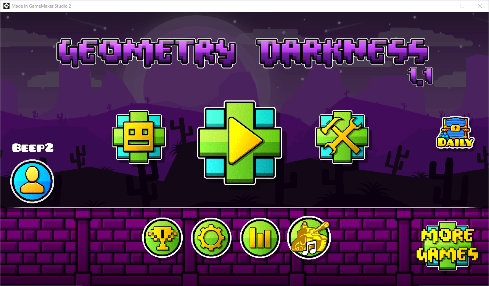
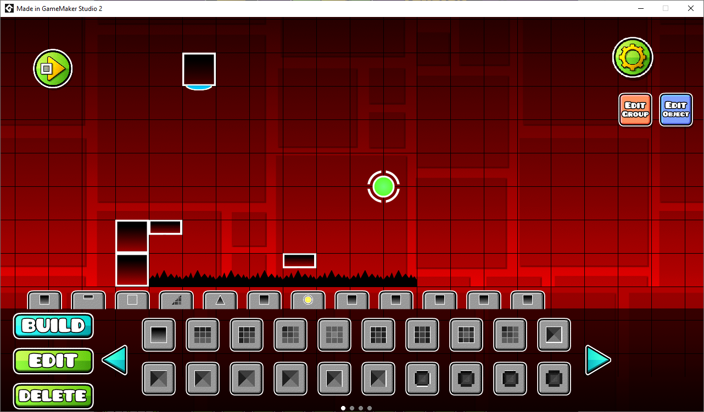
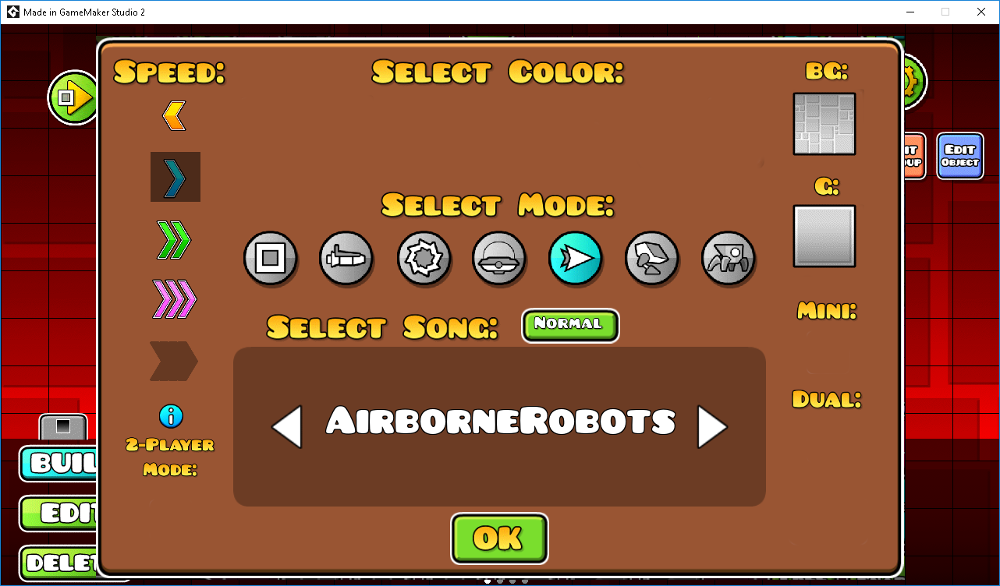

# Geometry Dash
Geometry dash (aka GDCommunity) is aimed to be an opensource clone of Geometry Dash with all its features, including servers, fully featured editor, Gauntlets, and many other features that never may be added, such as a realtime multiplayer.

Here's the actual game in action (This could change soon, so you better clone the repo and build it by yourself in GameMaker:Studio 2)

